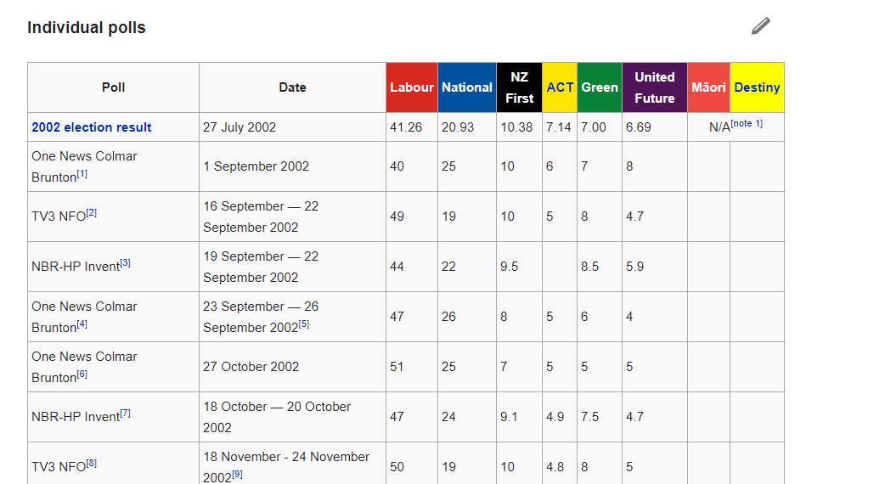

```{r setup, include=FALSE}
# needs to be run from the ./Session1/ directory
stripcolour <- "grey93"
library(knitr)
knitr::opts_chunk$set(echo = FALSE, warning = FALSE, message = FALSE)
library(kableExtra)
load("../../shiny/sims.rda")
```

## Today's content

- Election forecasts overview
- Data acquisition and management via its own R package
- Statistical modelling
- Dissemination with Shiny, Jekyll and Markdown

## To help pitch, hands up if you've...

(these aren't necessarily sequential)

- written one or more lines of R code
- made a plot with `ggplot` and been comfortable with what `aes(...)` means
- hated or loved `%>%` and have an opinion on `mutate`
- built your own R package
- written a program to fit a statistical model with Stan
- written an article that went viral and destroyed a statistician's career after a talk to an R users' group
- stood for Parliament

# Election forecasts overview

## Current forecasts {data-transition="fade-out"}


## Whereas six months before 2014 {data-transition="fade-out"}


## And for differing coalitions...

<a href = 'http://ellisp.github.io/' target = '_blank'>http://ellisp.github.io/</a>

Choose "Explore coalitions and assumptions" from "NZ Election Forecasts".

## Forecasts over time


## A range of possibilities


# Getting hold of data

## Polling data back to 2002  {data-transition="fade-out"}
```{r echo = TRUE}
p <- polls %>%
  filter(Party %in% c("Labour", "National", "NZ First", "Green")) %>%
  ggplot(aes(x = MidDate, y = VotingIntention, colour = Pollster)) +
  facet_wrap(~Party, scales = "free_y") +
  geom_line() +
  geom_text(aes(label = ifelse(Pollster == "Election result", "O", "")), 
            size = 8, colour = "black") +
  scale_y_continuous(label = percent) 

```

## Polling data back to 2002  {data-transition="fade-out"}
```{r}
print(p)
```

## On Wikipedia, it looks like this: {data-transition="fade-out"}



## We need it to be "tidy"

Wikipedia's format isn't bad as things go, but it's not a robust data model (eg the parties change each election; pollsters and their clients are wrapped up together; messy dates)

```{r results = 'asis', echo = TRUE}
library(nzelect)
sample_n(polls, 10) %>%
  kable(format = 'html') %>%
  kable_styling(font_size = 10)
```


## So first step is to clean up

- `nzelect` R package
- source code at [https://github.com/ellisp/nzelect](https://github.com/ellisp/nzelect) 

## Reflections on `nzelect`
  - if you're not using version control, you're in trouble
  - separate the grooming and preparation into `./prep/`, away from the package source code
  - a project or Git repository is bigger than a single R package (in this context - note this differs from the standard Wickham / RStudio approach)
  - building both R packages via `./integrate.R`
  - example grabbing polls via `./prep/download_polls_2017.R`
  - sometimes some things are easier and worth doing by hand

# Statistical modelling

## Three challenges in common to both methods

1. Sampling error from surveys
2. Other challenges for surveys
    - house effects
    - miscellaneous "total survey error""
3. People might change their mind 

*Predicting is difficult, particularly about the future*

## Approach

1. Probability of party vote on election day as a time series forecast
    - House effects and survey error as nuisance factors
2. Turn into simulated votes
3. Simulated votes get converted to seats

https://github.com/ellisp/nz-election-forecast/tree/master/setup
    
## Model A - GAMs


## House effects

https://github.com/ellisp/nz-election-forecast/blob/master/method-gam/estimate-house-effects.R


https://github.com/ellisp/nz-election-forecast/blob/master/method-gam/estimate-house-effects.stan

## Election day error


https://github.com/ellisp/nz-election-forecast/blob/master/method-gam/estimate-election-variance.R

## Model B - Latent State Space {data-transition="fade-out"}


## Model B - Latent State Space {data-transition="fade-in"}

https://github.com/ellisp/nz-election-forecast/tree/master/method-statespace

# Dissemination with Shiny, Jekyll and Markdown
## The main shiny app

https://github.com/ellisp/nz-election-forecast/tree/master/shiny

## The website

https://github.com/ellisp/nz-election-forecast/blob/master/setup/copy-files.R

https://github.com/ellisp/ellisp.github.io/tree/source/elections 

